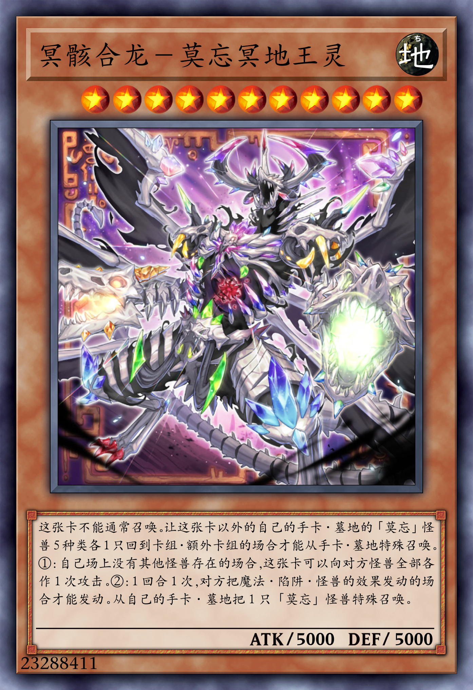
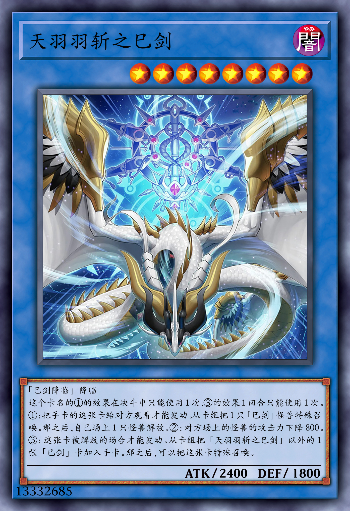
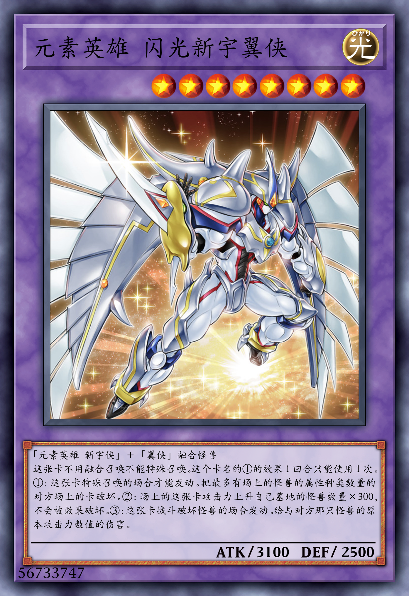
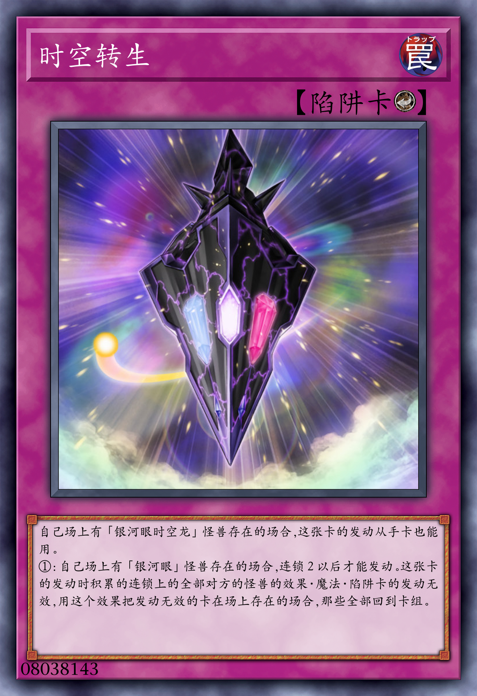
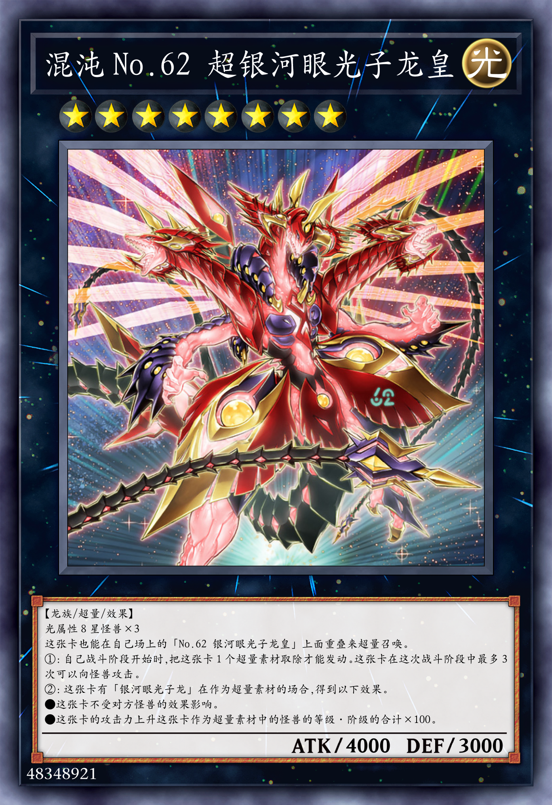
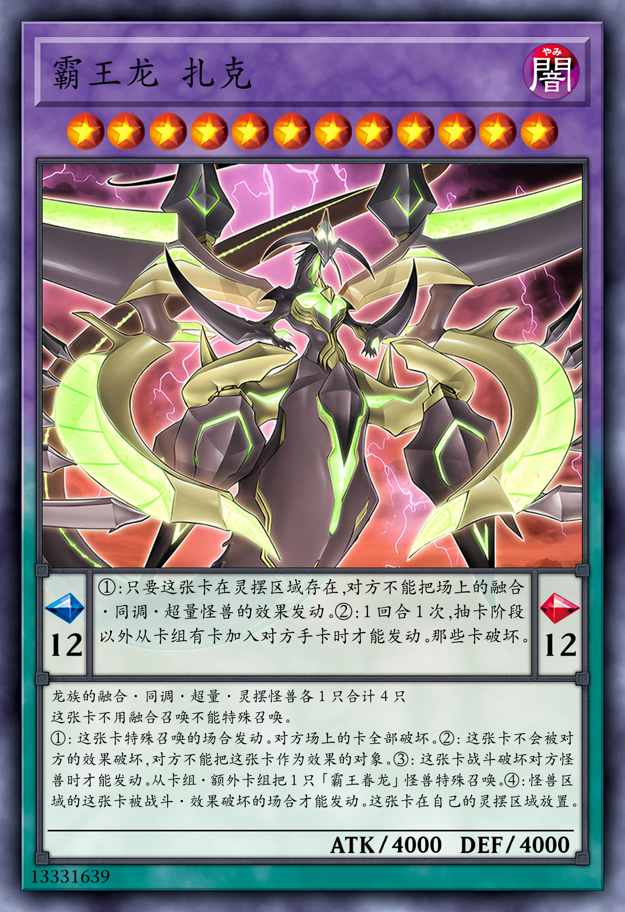
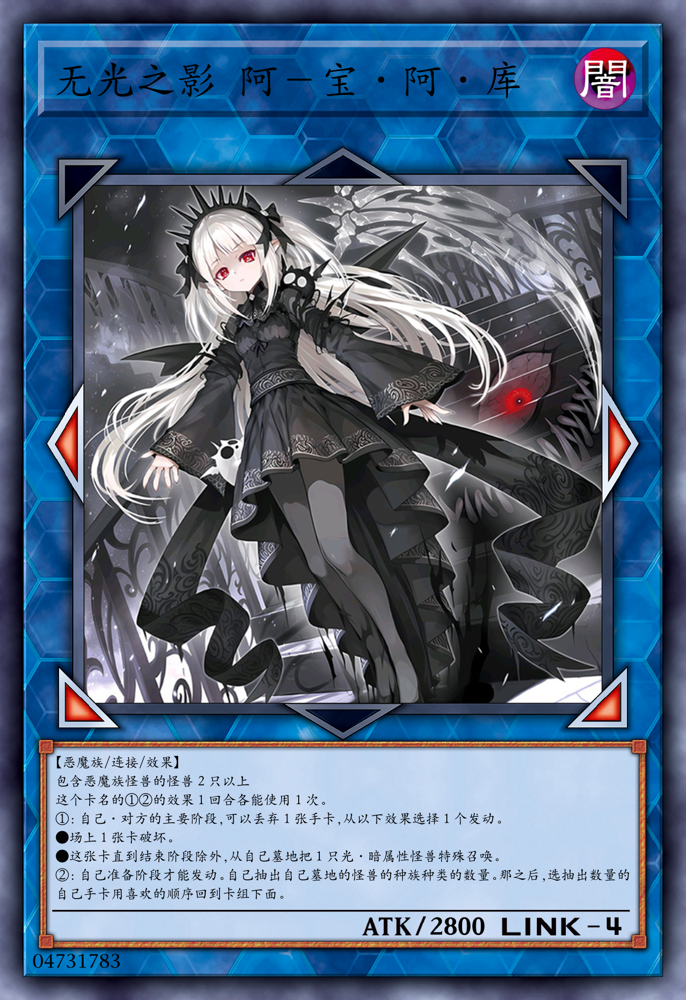
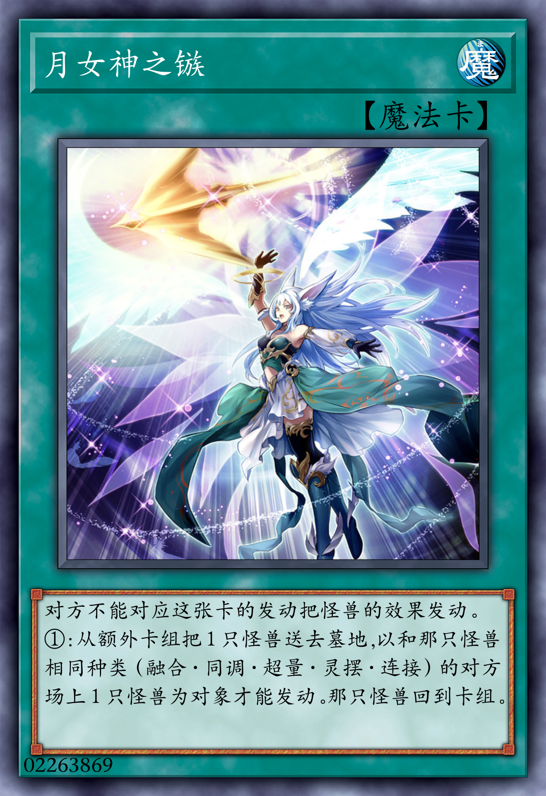
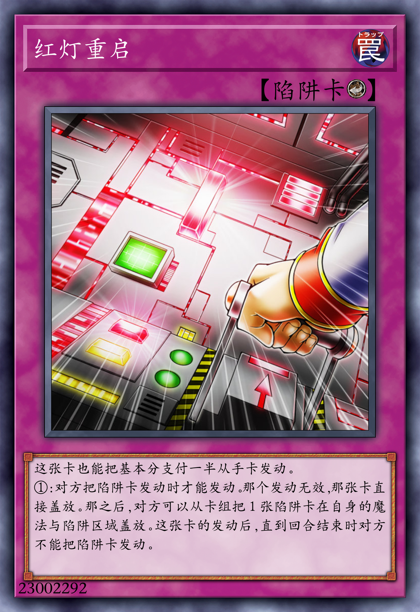

# typst-ygo

<!-- This template can be used to create a Yu-Gi-Oh! card using [Typst](https://typst.app/). -->
此[Typst](https://typst.app)模板可用于创作游戏王卡片.

## Note

<!-- - This template would not be submitted to [universe](https://typst.app/universe/).
- Simplified Chinese Only, so far.
- Sold cards Only.
- No DIY.
- This template may not update very frequently, because Yu-Gi-Oh! cards template(not on web) is very hard to make, and is not stable. So I will only update it when I have time and motivation, and I will not promise any update schedule. And not all problems will be solved, because there will not be any problem if every action is legal. -->
- 模板不会提交到[universe](https://typst.app/universe).
- 目前仅支持简体中文.
- 仅限已发售的卡片.
- 不支持 DIY 卡片.
- 模板可能不会非常频繁地更新,因为非web的游戏王卡片模板非常难做,而且不稳定.所以我只会在有时间和动力的时候更新,并且我不会承诺任何更新计划.并且不是所有问题都会被解决,因为如果每个参数(和行为)都是合法的就不会有任何问题.

## Examples

<table>
    <tbody>
        <tr>
            <td width="33%"></td>
            <td width="33%"></td>
            <td width="33%"></td>
        </tr>
        <tr>
            <td width="33%"></td>
            <td width="33%"></td>
            <td width="33%"></td>
        </tr>
        <tr>
            <td width="33%"></td>
            <td width="33%"></td>
            <td width="33%"></td>
        </tr>
    </tbody>
</table>

## Usage

### Assets

<!-- You must have the resource files like: [arshtyi/Card-Templates-Of-YuGiOh](https://github.com/arshtyi/Card-Templates-Of-YuGiOh). The file-tree should be like this repo(`assets/`), but you can also modify the file-tree as you like, just remember to use the correct path in the template. -->
使用此模板时应当拥有类似[arshtyi/Card-Templates-Of-YuGiOh](https://github.com/arshtyi/Card-Templates-Of-YuGiOh)的资源文件.文件树应当和本仓库(`assets/`)类似,但你也可以修改文件树,只要在模板中override正确的资源路径即可.

<!-- ### Arguments

|         Key         | Value Type |                                                                            Value                                                                            | Info                                            | 拥有卡片                      |
| :-----------------: | :--------: | :---------------------------------------------------------------------------------------------------------------------------------------------------------: | ----------------------------------------------- | ----------------------------- |
|        name         |  `string`  |                                                                              -                                                                              | 卡名，以 cn_name 为准(即 YGOPRO 风格)           | 所有                          |
|         id          |   `int`    |                                                                              -                                                                              | 卡片 ID,实际上是卡密                            | 所有                          |
|     description     |  `string`  |                                                                              -                                                                              | 效果                                            | 所有                          |
| pendulum_description |  `string`  |                                                                              -                                                                              | 灵摆效果                                        | 灵摆怪兽                      |
|        scale        |   `int`    |                                                                              -                                                                              | 灵摆刻度值,不区别左右                           | 灵摆怪兽                      |
|       link_value       |   `int`    |                                                                              -                                                                              | 链接值                                          | 链接怪兽                      |
|     link_markers     | `string[]` |                                              bottom-left,bottom,bottom-right,left,right,top-left,top,top-right                                              | 拥有的链接箭头                                  | 链接怪兽                      |
|      attribute      |  `string`  |                                                     light/dark/divine/earth/fire/water/wind/spell/trap                                                      | 卡片属性                                        | 所有                          |
|        race         |  `string`  |                                                   normal/continuous/field/equip/quick-play/ritual/counter                                                   | 魔法陷阱种类                                    | 魔法卡，陷阱卡                |
|         atk         |   `int`    |                                                                              -                                                                              | 怪兽的攻击力，-1 表示?                          | 怪兽卡                        |
|         def         |   `int`    |                                                                              -                                                                              | 怪兽的守备力，-1 表示?                          | 怪兽卡                        |
|        level        |   `int`    |                                                                              -                                                                              | 怪兽的等级或者阶级，-1 表示?                    | 怪兽卡                        |
|        frame         | `content`/`dictionary` | `make_frame(...)` | 卡片边框定义，使用结构化 frame，而不是拼接字符串 | 所有 |
|      type_line       |  `string`  |                                                                              -                                                                              | 情报栏                                          | 怪兽卡                        |
|      card_image      |   `int`    |                                                                              -                                                                              | 中心图 id 值                                    | 默认为 id 值，一些 token 不同 | -->

### Quick Start

<!-- Assuming you have the resource files in [assets](#assets) and write in the directory `template`: -->
假设你已经拥有了[assets](#assets)中的资源文件,并且在`template`目录下编写：

```typ
#import "../lib/mod.typ": card
#import "../lib/card/types.typ": card_kind, frame_family, make_frame, monster_frame
#card(
    atk: 4000,
    attribute: "dark",
    card_image: 13331639,
    def: 4000,
    description: "龙族的融合·同调·超量·灵摆怪兽各1只合计4只\n这张卡不用融合召唤不能特殊召唤。\n①：这张卡特殊召唤的场合发动。对方场上的卡全部破坏。②：这张卡不会被对方的效果破坏，对方不能把这张卡作为效果的对象。③：这张卡战斗破坏对方怪兽时才能发动。从卡组·额外卡组把1只「霸王眷龙」怪兽特殊召唤。④：怪兽区域的这张卡被战斗·效果破坏的场合才能发动。这张卡在自己的灵摆区域放置。",
    frame: make_frame(card_kind.monster, monster_frame.fusion, family: frame_family.pendulum),
    id: 13331639,
    level: 12,
    name: "霸王龙 扎克",
    pendulum_description: "①：只要这张卡在灵摆区域存在，对方不能把场上的融合·同调·超量怪兽的效果发动。②：1回合1次，抽卡阶段以外从卡组有卡加入对方手卡时才能发动。那些卡破坏。",
    scale: 12,
    type_line: "【龙族/灵摆/融合/效果】",
)
```

### Export

<!-- The PPI should be 600. -->
PPI的最佳值为600.
